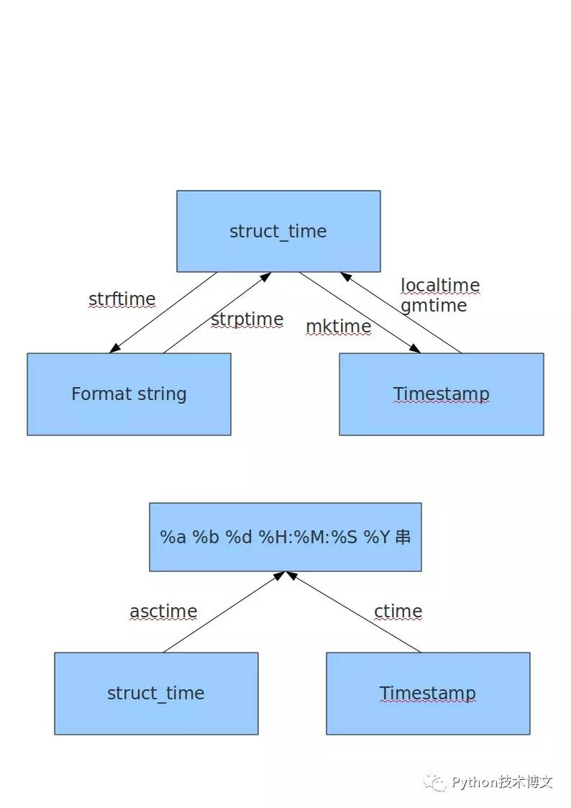

## Python time模块

### time模块

> UTC；格林威治时间，世界标准时间，在中国，UTC + 8
>
> 时间的表示形式：
>
> ​	a.时间戳【从1970.1.1 00：00:00到指定时间的秒数 】
>
> ​	b.元组形式【结构体】
>
> ​	c.格式化的字符串
>
> 掌握：时间三种不同形式之间的相互转换

__时间元祖格式__

> time.struct_time(tm_year=2011, tm_mon=5, tm_mday=5, tm_hour=14, tm_min=6, tm_sec=24, tm_wday=3, tm_yday=125, tm_isdst=0) 

| 索引（Index） | 属性（Attribute）         | 值（Values）       |
| ------------- | ------------------------- | ------------------ |
| 0             | tm_year（年）             | 比如2011           |
| 1             | tm_mon（月）              | 1 - 12             |
| 2             | tm_mday（日）             | 1 - 31             |
| 3             | tm_hour（时）             | 0 - 23             |
| 4             | tm_min（分）              | 0 - 59             |
| 5             | tm_sec（秒）              | 0 - 61             |
| 6             | tm_wday（weekday）        | 0 - 6（0表示周日） |
| 7             | tm_yday（一年中的第几天） | 1 - 366            |
| 8             | tm_isdst（是否是夏令时）  | 默认为-1           |

 

|      |                                                              |
| ---- | ------------------------------------------------------------ |
| 格式 | 含义                                                         |
| %a   | 本地（locale）简化星期名称                                   |
| %A   | 本地完整星期名称                                             |
| %b   | 本地简化月份名称                                             |
| %B   | 本地完整月份名称                                             |
| %c   | 本地相应的日期和时间表示                                     |
| %d   | 一个月中的第几天（01 - 31）                                  |
| %H   | 一天中的第几个小时（24小时制，00 - 23）                      |
| %I   | 第几个小时（12小时制，01 - 12）                              |
| %j   | 一年中的第几天（001 - 366）                                  |
| %m   | 月份（01 - 12）                                              |
| %M   | 分钟数（00 - 59）                                            |
| %p   | 本地am或者pm的相应符                                         |
| %S   | 秒（01 - 61）                                                |
| %U   | 一年中的星期数。（00 - 53星期天是一个星期的开始。）第一个星期天之前的所有天数都放在第0周。 |
| %w   | 一个星期中的第几天（0 - 6，0是星期天）                       |
| %W   | 和%U基本相同，不同的是%W以星期一为一个星期的开始。           |
| %x   | 本地相应日期                                                 |
| %X   | 本地相应时间                                                 |
| %y   | 去掉世纪的年份（00 - 99）                                    |
| %Y   | 完整的年份                                                   |
| %Z   | 时区的名字（如果不存在为空字符）                             |
| %%   | ‘%’字符                                                      |




| 方法                                        | 含义                                                         |
| ------------------------------------------- | ------------------------------------------------------------ |
| time.time()                                 | 获取当前时间的时间戳（1970纪元后经过的浮点秒数）。           |
| time.sleep(xx)                              | 线程睡眠时间，xx指秒数。                                     |
| time.clock()                                | 用以浮点数计算的秒数返回当前的CPU时间。用来衡量不同程序的耗时。两个clock一起用 |
| time.localtime(时间戳)                      | 时间戳转时间元祖，不指定时间戳默认当前时间戳                 |
| time.strftime('%Y-%m-%d %H:%M:%S',时间元祖) | 格式化显示格式，转成 struct_time 。不给时间元祖默认当前时间  |
| time.gmtime(时间戳)                         | 获取时间的元组形式                                           |
| time.ctime(时间戳)                          | 将时间戳转换为字符串                                         |
| time.strptime(字符串,"%Y-%m-%d  %H:%M:%S")  | 将时间字符串转换为时间元组                                   |
|                                             |                                                              |

### 日历模块 calendar

| 方法                                 | 解释                                                         |
| ------------------------------------ | ------------------------------------------------------------ |
| calendar.calendar(year,w=2,l=1,c=6)  | 返回一个多行字符串格式的year年年历，3个月一行，间隔距离为c。 每日宽度间隔为w字符。每行长度为21* W+18+2* C。l是每星期行数。 |
| calendar.firstweekday( )             | 返回当前每周起始日期的设置。默认情况下，首次载入caendar模块时返回0，即星期一。 |
| calendar.isleap(year)                | 是闰年返回 True，否则为 False。calendar.isleap(2000) >>True  |
| calendar.leapdays(y1,y2)             | 返回在Y1，Y2两年之间的闰年总数。                             |
| calendar.month(year,month,w=2,l=1)   | 返回一个多行字符串格式的year年month月日历，两行标题，一周一行。每日宽度间隔为w字符。每行的长度为7* w+6。l是每星期的行数。 |
| calendar.monthcalendar(year,month)   | 返回一个整数的单层嵌套列表。每个子列表装载代表一个星期的整数。Year年month月外的日期都设为0;范围内的日子都由该月第几日表示，从1开始。 |
| calendar.monthrange(year,month)      | 返回两个整数。第一个是该月的星期几的日期码，第二个是该月的日期码。日从0（星期一）到6（星期日）;月从1到12。 |
| calendar.prcal(year,w=2,l=1,c=6)     | 相当于 print calendar.calendar(year,w=2,l=1,c=6)。           |
| calendar.prmonth(year,month,w=2,l=1) | 相当于 print calendar.calendar(year,month,w=2,l=1)。         |
| calendar.setfirstweekday(weekday)    | 设置每周的起始日期码。0（星期一）到6（星期日）。             |
| calendar.timegm(tupletime)           | 和time.gmtime相反：接受一个时间元组形式，返回该时刻的时间戳（1970纪元后经过的浮点秒数）。 |
| calendar.weekday(year,month,day)     | 返回给定日期的日期码。0（星期一）到6（星期日）。月份为 1（一月） 到 12（12月）。 |

### 日期模块 datetime

| 方法                                          | 解释                   |
| --------------------------------------------- | ---------------------- |
| datetime.datetime.now()                       | 获取当前时间           |
| datetime.datetime(2018,11,19,15,30,23,895404) | 获取指定时间           |
| datetime.datetime.now().strftime("%Y.%m.%d")  | 将时间对象转换为字符串 |
| datetime.datetime.strptime(字符串,"%Y.%m.%d") | 将字符串转换为时间对象 |
| datetime.datetime() - datetime.datetime()     | 时间的减法运算         |

 ## 参考

#### 递归遍历目录

> 代码演示：
>
> ```python
> import  os
> 
> #1.递归
> #C:\Users\Administrator\Desktop\
> 
> #需求：获取指定路径下所有的文件以及子文件
> def getAll(path):
>     #获取当前路径下所有内容的列表
>     fileList = os.listdir(path)
>     #print(fileList)
> 
>     #遍历文件列表
>     for fileName in fileList:
>         #和初始路径进行拼接
>         filePath = os.path.join(path,fileName)
>         #print(filePath)
> 
>         #判断子路径是否是目录
>         if os.path.isdir(filePath):
>             #说明子路径的子路径仍然是一个目录，则需要重复前面的操作【获取所有内容，拼接，判断】
>             #递归调用函数本身
>             getAll(filePath)
>         else:
>             if fileName.endswith(".py"):
>                 print("文件：", filePath)
> 
> p = r"C:\Users\Administrator\Desktop"
> getAll(p)
> ```

#### 栈模拟递归遍历目录

> 深度遍历
>
> 代码演示：
>
> ```python
> import  os
> 
> def getAll(path):
>     #定义一个空栈【列表】
>     stack = []
> 
>     #将初始路径添加到栈中
>     stack.append(path)
> 
>     #思路：只有发现指定路径是目录，则添加到栈中
>     #处理栈：当栈为空的时候说明所有的内容遍历完了，循环停止
>     while len(stack) != 0:
>         #从栈中取出数据
>         dirPath = stack.pop()
> 
>         #获取指定路径下所有的内容
>         fileList = os.listdir(dirPath)
> 
>         #遍历列表
>         for fileName in fileList:
>             #拼接路径
>             filePath = os.path.join(dirPath,fileName)
> 
>             #判断是否是目录
>             if os.path.isdir(filePath):
>                 print("目录：", filePath)
>                 #如果是目录，则将目录的路径添加到栈中，然后重复前面的操作【获取内容，遍历，判断】
>                 stack.append(filePath)
>             else:
>                 print("文件：",filePath)
> 
> 
> p = r"C:\Users\Administrator\Desktop"
> getAll(p)
> ```

#### 队列模拟递归遍历目录

> 广度遍历
>
> 代码演示：
>
> ```python
> import  os
> import  collections
> 
> #3.队列模拟递归遍历
> def getAll(path):
>     #创建一个队列
>     queue = collections.deque()
> 
>     #入队
>     queue.append(path)
> 
>     while len(queue) != 0:
>         #出队
>         dirPath = queue.popleft()
> 
>         #获取初始路径下所有的内容
>         fileList = os.listdir(dirPath)
> 
>         #遍历列表
>         for fileName in fileList:
>             #路径拼接
>             filePath = os.path.join(dirPath,fileName)
> 
>             #判断是否是目录
>             if os.path.isdir(filePath):
>                 print("目录：", filePath)
>                 queue.append(filePath)
> 
>             else:
>                 print("文件：",filePath)
> 
> p = r"C:\Users\Administrator\Desktop"
> getAll(p)
> ```

